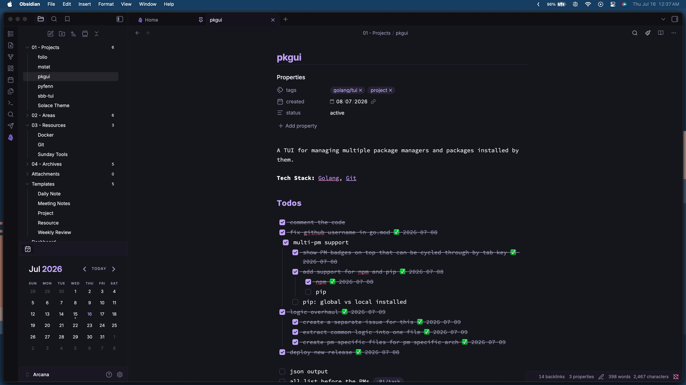
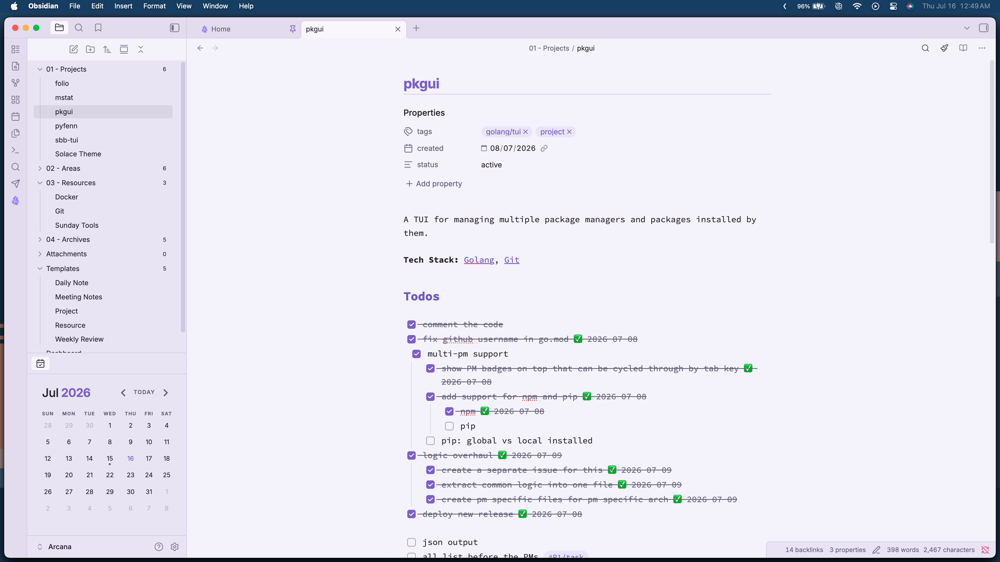

<div align="center">




# Solace

A minimal Obsidian theme with violet undertones and pastel syntax.

[](LICENSE) [](https://obsidian.md)

</div>

---

A port of the [Solace](https://github.com/bhavya-dang/Solace) theme — originally built for Zed — to Obsidian.

> Disclosure: AI was used to port the theme to Obsidian and write this README. However, AI was **not** used for the original Zed theme.

## Variants

Solace ships with three color variants:

| Variant   | Background | Accent    | Description                                       |
| --------- | ---------- | --------- | ------------------------------------------------- |
| **Dark**  | `#16141F`  | `#C9A8FF` | Deep violet dark theme. Default in dark mode.     |
| **Light** | `#F6F3FC`  | `#8A63D2` | Warm lavender light theme. Default in light mode. |
| **Dusk**  | `#191725`  | `#B89EF0` | A softer dark theme between Dark and Light.       |

Variants can be set using [Style Settings](https://github.com/StyleSettings/obsidian-style-settings).

## Features

- **Full syntax highlighting** — Pastel palette for comments, keywords, strings, variables, definitions, operators, and more.
- **Complete UI theming** — Sidebar, tabs, modals, command palette, graph view, file explorer, settings, and every Obsidian surface.
- **Style Settings integration** — Customize variant, fonts, accent colors, editor line height, code block styling, border radius, and more.
- **Callout support** — Color-coded callouts for note, tip, warning, danger, bug, question, and more.
- **Plugin compatibility** — Styled for Dataview, Kanban, and DB Folder.
- **Mobile support** — Dedicated styles for sidebar, ribbon, modals, and markdown preview.
- **Custom scrollbars** — Thin, minimal scrollbars.
- **Obsidian 1.4+ color variables** — Full `--color-base-*` and `--color-accent-*` mappings.

## Typography

| Role             | Font                                                                                                     |
| ---------------- | -------------------------------------------------------------------------------------------------------- |
| Interface & text | [Inter](https://fonts.google.com/specimen/Inter)                                                         |
| Monospace        | [JetBrains Mono](https://www.jetbrains.com/lp/mono/), Fira Code, SF Mono, Cascadia Code, Source Code Pro |

## Installation

### Manual

1. Download or clone this repository
2. Copy the folder to your themes directory:
   - **macOS / Linux:** `~/.obsidian/themes/solace/`
   - **Windows:** `%APPDATA%\obsidian\themes\solace\`
3. Open/Restart Obsidian, go to **Settings > Appearance > Themes**, and select **Solace**

### BRAT Plugin

Install directly from GitHub using [BRAT](https://github.com/TfTHacker/obsidian42-brat) with the URL:

```
https://github.com/bhavya-dang/solace-obsidian
```

## Customization

Install the [Style Settings](https://github.com/StyleSettings/obsidian-style-settings) plugin to unlock the full configuration panel. Options include:

- **Variant** — Switch between Dark, Light, and Dusk
- **Typography** — Interface font, text font, monospace font
- **Colors** — Accent color, background, text color
- **Editor** — Line height, font size, max width
- **Code blocks** — Font size, line height, padding
- **UI** — Border radius, transition speed, sidebar width, ribbon width
- **Callouts, tables, images** — Border radius, padding, borders
- **Reading view** — Max width
- **Graph view** — Line width

## License

[MIT](LICENSE) — Bhavya Dang ([bhavyadang.in](https://bhavyadang.in))

Original Solace theme for Zed: [github.com/bhavya-dang/Solace](https://github.com/bhavya-dang/Solace)
