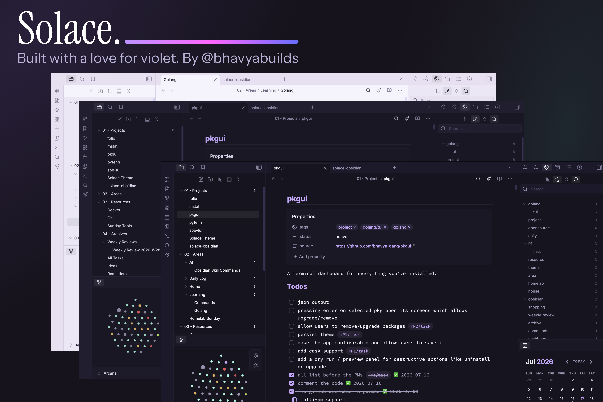

   

---

Solace is a clean, minimal theme built around a soft violet palette. Originally created for [Zed](https://github.com/Solace-Theme/Solace), it has been brought to Obsidian with the same attention to detail and restraint.

## Variants

| Variant   | Background | Accent    |
| --------- | ---------- | --------- |
| **Dark**  | `#16141F`  | `#C9A8FF` |
| **Light** | `#F6F3FC`  | `#8A63D2` |
| **Dusk**  | `#191725`  | `#B89EF0` |

Switch variants from **Settings** > **Appearance** > **Solace** > **Style Settings**.

## Features

- **Syntax highlighting:** Full pastel palette for comments, keywords, strings, variables, definitions, operators, and more.
- **Custom checkboxes:** Half-filled checkboxes for in-progress tasks with `- [/]`.
- **Properties panel:** Styled frontmatter with themed backgrounds, borders, and accent-colored keys.
- **Tables:** Themed headers, alternating row colors, and hover effects using Obsidian's CSS variables.
- **Tags:** Properly styled inline tags in both editor and reading view with pill-shaped borders.
- **Callouts:** Color-coded callouts with [type-specific accent colors, custom Lucide icons](#callouts), and three style variants (Filled, Outlined, Minimal).
- **Code blocks:** Themed syntax highlighting with language-specific accent colors.
- **Text selection:** Violet-tinted selection highlight across all variants.
- **UI theming:** Sidebar, tabs, modals, command palette, graph view, file explorer, settings, and reading view.
- **Plugin support:** Styled for Dataview, Kanban, and DB Folder.
- **Mobile optimized:** Dedicated styles for sidebar, ribbon, and markdown preview.
- **Style Settings:** Full integration with [Style Settings](https://github.com/mgmeyers/obsidian-style-settings) for customizing accent colors, fonts, density, callout styles, and more.

## Preview

    
    
    

## Callouts

| Type       | Aliases                | Color     | Icon                    |
| ---------- | ---------------------- | --------- | ----------------------- |
| `note`     |                        | `#9880e8` | `lucide-pencil`         |
| `info`     |                        | `#9880e8` | `lucide-info`           |
| `todo`     |                        | `#9880e8` | `lucide-circle-check`   |
| `tip`      | `hint`, `important`    | `#a8ffec` | `lucide-lightbulb`      |
| `success`  |                        | `#a8ffec` | `lucide-check-circle-2` |
| `warning`  | `caution`, `attention` | `#ffd666` | `lucide-alert-triangle` |
| `danger`   | `error`                | `#ff80c8` | `lucide-x`              |
| `failure`  |                        | `#ff80c8` | `lucide-x`              |
| `bug`      |                        | `#ff80c8` | `lucide-bug`            |
| `example`  |                        | `#ffb3d1` | `lucide-list`           |
| `quote`    | `cite`                 | `#a09ab8` | `lucide-quote`          |
| `abstract` | `summary`              | `#a09ab8` | `lucide-clipboard-list` |
| `question` | `help`, `faq`          | `#9880e8` | `lucide-help-circle`    |

## Installation

**Community Themes:**

1. Open **Settings** > **Appearance**
2. Click **Manage** next to Community Themes
3. Search for **Solace** and click **Use**

**Manual:**

1. Download the [latest release](https://github.com/Solace-Theme/solace-obsidian/releases/latest)
2. Extract to your vault's themes folder:
   - macOS / Linux: `~/.obsidian/themes/Solace/`
   - Windows: `%APPDATA%\obsidian\themes\Solace\`
3. Restart Obsidian and select **Solace** from **Settings** > **Appearance** > **Themes**

## Style Settings

Solace integrates with the [Style Settings](https://github.com/mgmeyers/obsidian-style-settings) plugin for deep customization:

- **Theme Variant** - Switch between Dark, Light, and Dusk
- **Typography** - Interface, text, and monospace font families
- **Colors** - Accent, background, and text colors
- **Editor** - Line height, font size, and max width
- **Code Blocks** - Font size, line height, and padding
- **UI** - Border radius and transition speed
- **Tables, Images, Links, Headings** - Fine-tune individual elements

## Typography

| Role             | Font                                                                                                     |
| ---------------- | -------------------------------------------------------------------------------------------------------- |
| Interface & text | [Inter](https://fonts.google.com/specimen/Inter)                                                         |
| Monospace        | [JetBrains Mono](https://www.jetbrains.com/lp/mono/), Fira Code, SF Mono, Cascadia Code, Source Code Pro |

## Contributing

If you find a bug or want to request a feature, please [open an issue](https://github.com/Solace-Theme/solace-obsidian/issues).

## License

[MIT](LICENSE) - Bhavya Dang ([bhavyadang.in](https://bhavyadang.in))
