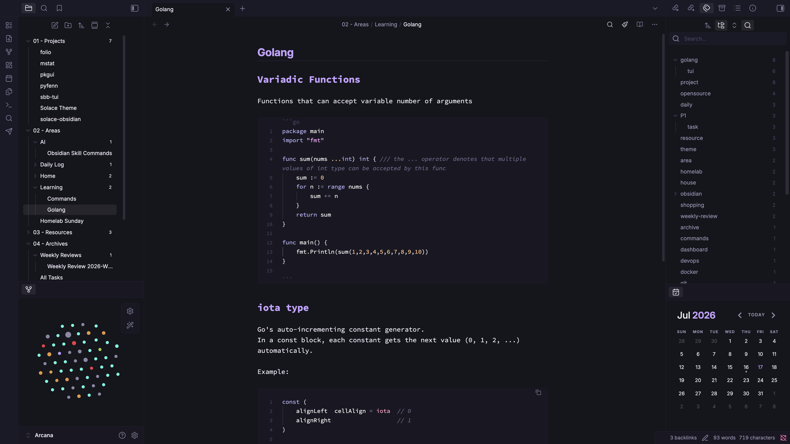
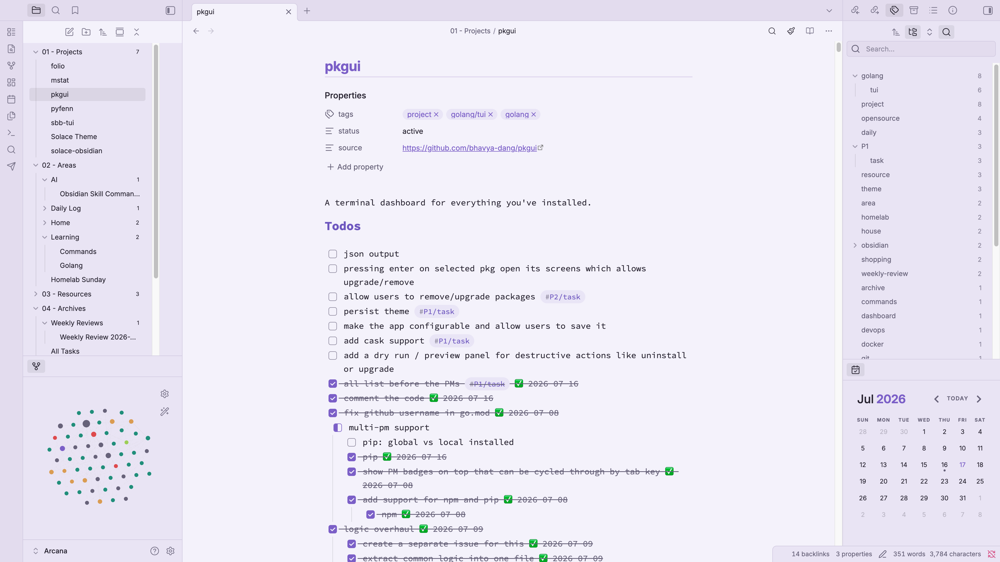

   

---

Solace is a clean, minimal theme built around a soft violet palette. Originally created for [Zed](https://github.com/Solace-Theme/Solace), it has been brought to Obsidian with the same attention to detail and restraint.

## Variants

| Variant   | Background | Accent    |
| --------- | ---------- | --------- |
| **Dark**  | `#16141F`  | `#C9A8FF` |
| **Light** | `#F6F3FC`  | `#8A63D2` |

## Features

- **Syntax highlighting:** Full pastel palette for comments, keywords, strings, variables, definitions, operators, and more.
- **Custom checkboxes:** Half-filled checkboxes for in-progress tasks with `- [/]`.
- **UI theming:** Sidebar, tabs, modals, command palette, graph view, file explorer, settings, and reading view.
- **Plugin support:** Styled for Dataview, Kanban, and DB Folder.
- **Mobile optimized:** Dedicated styles for sidebar, ribbon, and markdown preview.
- **Callouts:** Color-coded styling for all built-in types.

## Preview

    
    

## Installation

**Community Themes:**

1. Open **Settings** > **Appearance**
2. Click **Manage** next to Community Themes
3. Search for **Solace** and click **Use**

**Manual:**

1. Download the [latest release](https://github.com/Solace-Theme/solace-obsidian/releases/latest)
2. Extract to your vault's themes folder:
   - macOS / Linux: `~/.obsidian/themes/Solace/`
   - Windows: `%APPDATA%\obsidian\themes\Solace\`
3. Restart Obsidian and select **Solace** from **Settings** > **Appearance** > **Themes**

## Typography

| Role             | Font                                                                                                     |
| ---------------- | -------------------------------------------------------------------------------------------------------- |
| Interface & text | [Inter](https://fonts.google.com/specimen/Inter)                                                         |
| Monospace        | [JetBrains Mono](https://www.jetbrains.com/lp/mono/), Fira Code, SF Mono, Cascadia Code, Source Code Pro |

## Contributing

If you find a bug or want to request a feature, please [open an issue](https://github.com/Solace-Theme/solace-obsidian/issues).

## License

[MIT](LICENSE) - Bhavya Dang ([bhavyadang.in](https://bhavyadang.in))
